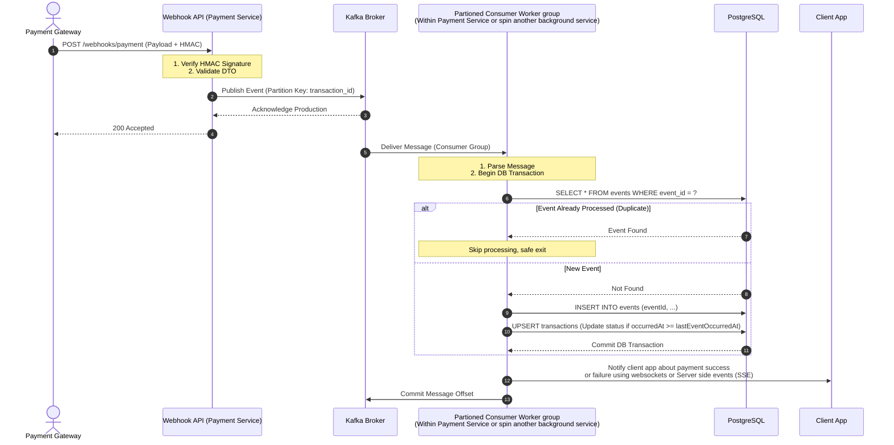

# Design Doc - Payment Status Service

## 1. Architecture


1. The webhook API returns a Accepted response in under 30 milliseconds, preventing gateway timeouts during high traffic.
1. Instead of waiting for database writes with webhook api controller, the event is immediately pushed to Kafka using the transaction_id as the key. 
    - This guarantees that all events for a specific transaction are processed strictly in order by Kafka.
3. A separate background consumer worker group process messages from the Kafka topic(and partition) and notifies the client app once processed.


## 2. Data Store and Models
1. Created two tables in postgres ie, `payments` and `payment_events`.
2. `payment_events` table has **many-to-one** relationship with `payments`
3. Using Kafka Direct Streams for handling payment events at scale - for ensuring high availability, low-latency and data persistency
4. Using topic partitions and DB indexes to quick lookups and processing

## 3. Idempotency
1. Considering the event id as unique identifier to avoid the duplicate processing of event.
2. Event Id is registered at Primary Key in database


## 4. Ordering (event ordering and correct latest Transaction Status)
1. Ordering and correct latest Transaction Status is maintained based on occurred_at field in the event received in webhook.
```ts
const prevRecordedEvent = await transactionalEntityManager.findOne(EventLog, {
    where: { transactionId: transaction_id},
    order: { occurredAt: 'DESC'}
})
if (prevRecordedEvent && prevRecordedEvent.occurredAt > new Date(occurred_at))
    return;
```


## 5. Failure handling
1. Event will be pushed to dead letter queue if the event processing fails at consumer
    - Different dead letter queues can be created for failures at different stages while processing the event
2. Dead Letter queue handling is not in place right now in code and should be implemented based on business requirements.


## 6. Scaling
1. This design can well handle 10,000 webhooks/second with few caveats:
    - Must run cluster of consumers in a consumer group and increase the partitions in production.
    - *Must implement Sharding in the database system.* Range-based sharding is one of straight-forward strategies that can be implmented to overcome it.
    - database connection pooling should be there in place, requiring multiple replicas of database as well. 
    - Must run cluster of payment microservice processes
    - Observability
2. The possible bottlenecks would either be Database or missing batch processing of events leading to a filled queue and delayed processing


## 7. Observability
1. Metrics (CPU utilization, memory consumption, scale in-out) can be observed using tools like Prometheus and Grafana.
2. It should generate automated alerts for:
    - reaching threshold limits CPU/memory usage
    - growing difference b/w produced and consumed offsets in a topic and reaching threshold limits
    - database cpu usage and connection reaching threshold limits.
3. Logging and tracing (Dynatrace/Splunk) should be there is place and different level application logs can be analysed there in a dashboard.
    - It should generate alerts for over failures reaching threshold percentage limits